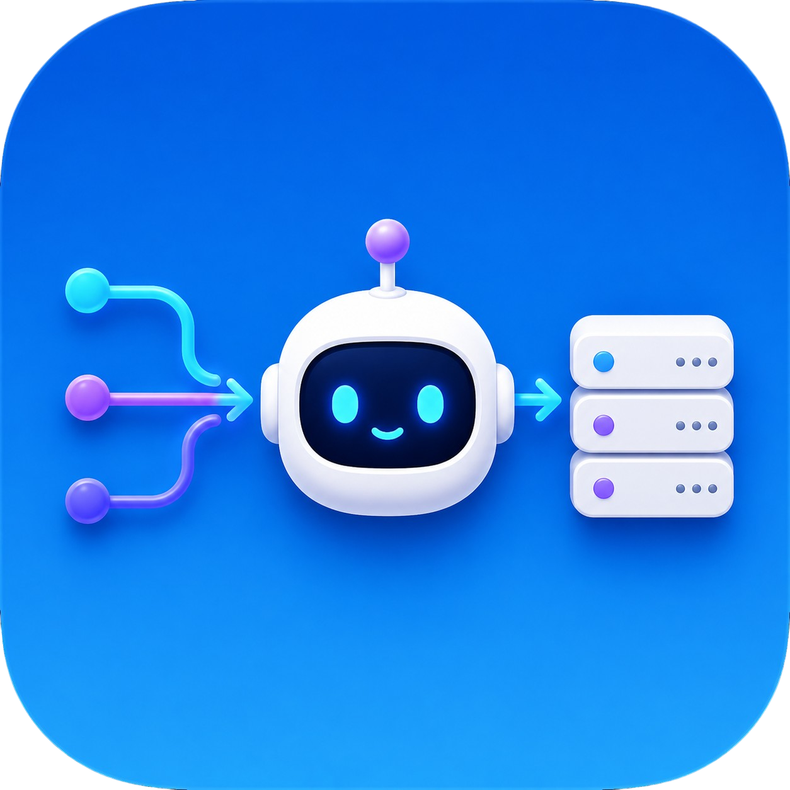

<p align="center">
  
</p>

<h1 align="center">RouterBot</h1>

<p align="center">
  <strong>One OpenAI-compatible endpoint — route to every AI backend you run.</strong>
</p>

<p align="center">
  Claude Code · Codex · Cursor Agent · Gemini CLI · Ollama · vLLM · custom CLIs
</p>

<p align="center">
  <a href="LICENSE"></a>
  <a href="https://nodejs.org"></a>
</p>

---

RouterBot is a self-hosted **OpenAI-compatible API router**. Point any client that supports a custom OpenAI base URL, model name, and API key at RouterBot — IDEs, chat UIs, agents, scripts, or your own app. RouterBot classifies each request, picks a backend provider, runs your configured CLIs or HTTP APIs, and falls back automatically when something fails.

**Works with:** Continue, Open WebUI, LibreChat, LangChain, custom HTTP clients, and any tool that speaks `POST /v1/chat/completions` and `GET /v1/models`. Cursor is a common example, not a requirement.

No vendor lock-in to one CLI — mix Anthropic, OpenAI, Google, and local models behind one dashboard and one API key.

## What's new in v0.2.1

- **Unified provider sign-in** — one auth panel for Claude, Codex, Cursor Agent, and Gemini; detects already-signed-in state; **Re-sign in** when you need a fresh login
- **Real model lists** — dropdowns show only models each provider actually exposes (no synthetic placeholders); Codex discovery from the installed CLI
- **Inbound API activity** — Activity log records `GET /v1/models` and `POST /v1/chat/completions` (start, success, errors, duration)
- **Quieter dashboard** — status polling no longer spams the log or closes open dropdowns
- **22 automated tests** — auth flows, model alignment, release hygiene scan

## Why RouterBot?

| Problem | RouterBot |
|---------|-----------|
| Each app wants its own base URL and backend | One `/v1` endpoint, many providers |
| Switching between Claude / Codex / Gemini is manual | Task-based routing (`code` → Codex, `plan` → Claude, …) |
| Remote server has no browser for CLI login | Dashboard opens OAuth/device-login URLs **on your PC** |
| Homelab needs HTTPS for remote clients | Built-in Tailscale Serve/Funnel helpers and URL preview |
| Want Ollama or vLLM beside cloud CLIs | HTTP providers + generic CLI adapters |

## Features

- **OpenAI-compatible API** — `/v1/models`, `/v1/chat/completions` (streaming supported)
- **Web dashboard** — enable providers, pick models, authenticate CLIs, live activity log
- **Task routing** — keyword classifier sends `code`, `debug`, `plan`, etc. to different backends
- **Fallback chain** — configurable order when the primary provider errors out
- **Built-in providers** — Claude Code, Codex, Cursor Agent, Gemini CLI
- **Bring your own** — OpenAI-compatible HTTP (Ollama, LM Studio, vLLM) or any stdin CLI
- **Emoji provider icons** — click to customize; set when adding a provider
- **Security** — one API key for `/v1` and admin `/api`; auto-generated on first run
- **Production helpers** — systemd units, Tailscale setup script, health checks

## Quick start

**Requirements:** Node.js 20+, and whichever CLIs you enable on your `PATH`.

```bash
git clone git@github.com:SketchOTP/routerbot.git
cd routerbot
npm install
npm start
```

Open the dashboard: **http://127.0.0.1:4117**

On first run, RouterBot prints a generated API key — save it for API clients and remote dashboard access.

Optional: seed config from the example:

```bash
mkdir -p data
cp config.example.json data/config.json
# edit tailscaleHost, providers, routing…
```

## Connect a client

Any OpenAI-compatible client needs three values from the dashboard:

| Setting | Value |
|---------|-------|
| **Base URL** | RouterBot URL ending in `/v1` (e.g. `http://127.0.0.1:4117/v1`) |
| **API key** | Your RouterBot API key |
| **Model** | `routerbot-local` (or your `server.exposedModel`) |

**Local only:** `http://127.0.0.1:4117/v1`

**Remote clients** (cloud agents, phones, other machines) need a reachable HTTPS URL — see [Public access](#public-access).

### Example: Cursor

| Setting | Value |
|---------|-------|
| Override OpenAI Base URL | `https://YOUR_HOST:10000/v1` (or local URL above) |
| API key | RouterBot API key |
| Model | `routerbot-local` |

### Example: curl

```bash
curl -s http://127.0.0.1:4117/v1/chat/completions \
  -H "Authorization: Bearer YOUR_API_KEY" \
  -H "Content-Type: application/json" \
  -d '{"model":"routerbot-local","messages":[{"role":"user","content":"Hello"}]}'
```

## Dashboard tour

Sign-in is unified across providers:

| Provider | Flow |
|----------|------|
| Claude / Cursor Agent | Browser link (opens on your PC) |
| Codex | Device URL + one-time code |
| Gemini | Google link + paste authorization code |

- If already signed in, the dashboard shows **Already signed in** (no blank popup).
- Click **Re-sign in** to force a fresh login.
- Click **↻** on a provider card to load its real model list.
- Health dots refresh automatically after sign-in completes.

```
┌─────────────────────────────────────────────────────────┐
│  Metrics: Base URL · Model · API key · Provider health  │
├─────────────────────────────────────────────────────────┤
│  Providers (cards)     │  Routing · Fallback chain     │
│  · toggle / model      │  · task → provider map        │
│  · sign-in buttons     │  · default provider           │
│  · emoji icons         │                               │
├────────────────────────┴───────────────────────────────┤
│  Activity log (API requests, routes, fallbacks, auth)   │
└─────────────────────────────────────────────────────────┘
```

- **Server settings** (gear) — Tailscale host, funnel ports, API key, exposed model name
- **Add provider** — HTTP API or generic CLI, with icon picker
- **Fallback chain** — reorder providers tried after a failure

## API key

One key protects both the OpenAI API (`/v1`) and the admin API (`/api`).

| How | Steps |
|-----|--------|
| **First startup** | Printed in the terminal when `data/config.json` has no key |
| **Dashboard** | `http://127.0.0.1:4117` → Server settings → API key |
| **Config file** | `grep apiKey data/config.json` |
| **Environment** | `ROUTERBOT_API_KEY=…` (overrides file) |

Rotate anytime in Server settings → **Save** → update your clients.

If port `4117` is in use, RouterBot is already running (e.g. systemd) — use `sudo systemctl restart routerbot` instead of a second `npm start`.

## Providers

### Built-in CLI backends

| Provider | CLI | Auth |
|----------|-----|------|
| Claude Code | `claude` | Browser sign-in (opens on your PC) |
| Codex | `codex` | Device login + one-time code |
| Cursor Agent | `cursor-agent` | Browser sign-in |
| Gemini CLI | `gemini` | Google OAuth + paste auth code |

### Custom backends

**HTTP** (Ollama, vLLM, LM Studio, any OpenAI-compatible server):

```json
"ollama": {
  "type": "http",
  "label": "Ollama",
  "icon": "🦙",
  "enabled": true,
  "baseUrl": "http://127.0.0.1:11434/v1",
  "model": "llama3.2"
}
```

**Generic CLI** (any tool that reads a prompt on stdin):

```json
"my-cli": {
  "type": "generic-cli",
  "label": "My Tool",
  "icon": "🔧",
  "command": "my-cli",
  "runArgs": ["-m", "{{model}}", "-"],
  "model": "default"
}
```

See [CONTRIBUTING.md](CONTRIBUTING.md) to extend built-in adapters.

## Routing & fallback

1. RouterBot classifies the prompt (`code`, `debug`, `plan`, …).
2. It uses the mapped provider from the dashboard (or `routing.defaultProvider`).
3. On failure, it walks `routing.fallbackChain` (default: `codex` → `cursor`).

Configure both in the **Routing** panel; new providers appear in dropdowns automatically.

## Public access

Remote clients cannot reach `localhost`. Expose RouterBot over HTTPS when callers run on another machine or in the cloud.

### Tailscale (recommended)

```bash
./scripts/tailscale-setup.sh   # once, requires sudo
```

| Port | Use |
|------|-----|
| `9420` | Tailnet dashboard (private) |
| `10000` | Public Funnel → `https://YOUR_HOST:10000/v1` |

Set `server.tailscaleHost` in the dashboard, then **Save**.

### Quick tunnels

```bash
# cloudflared
cloudflared tunnel --url http://127.0.0.1:4117

# ngrok
ngrok http 4117
```

Use the HTTPS URL + `/v1` as your client base URL.

## Run at boot (systemd)

```bash
chmod +x scripts/install-systemd.sh scripts/tailscale-setup.sh scripts/check-routerbot.sh
./scripts/install-systemd.sh
```

```bash
ROUTERBOT_USER=your-user ./scripts/install-systemd.sh
sudo systemctl status routerbot
./scripts/check-routerbot.sh
```

## Configuration

| Source | Purpose |
|--------|---------|
| `data/config.json` | Main config (created at runtime, **not** committed) |
| `config.example.json` | Starter template |
| `.env.example` | Environment variable reference |

| Variable | Description |
|----------|-------------|
| `ROUTERBOT_HOST` | Bind address (default `127.0.0.1`) |
| `ROUTERBOT_PORT` | Port (default `4117`) |
| `ROUTERBOT_API_KEY` | API key override |

## Security

Read **[SECURITY.md](SECURITY.md)** before exposing RouterBot on the public internet.

- Use a strong, unique API key when using Tailscale Funnel or tunnels.
- Never commit `data/config.json` (contains keys and hostnames).
- Tailscale Funnel exposes the full app — protect with key + ACLs.

Built-in CLIs run in read-only / ask modes where supported; custom CLIs run whatever you configure.

## Development

```bash
npm run dev      # watch mode
npm test         # unit tests
npm run check    # tests + release scan
```

## License

MIT © [Tym Huseby](LICENSE)
